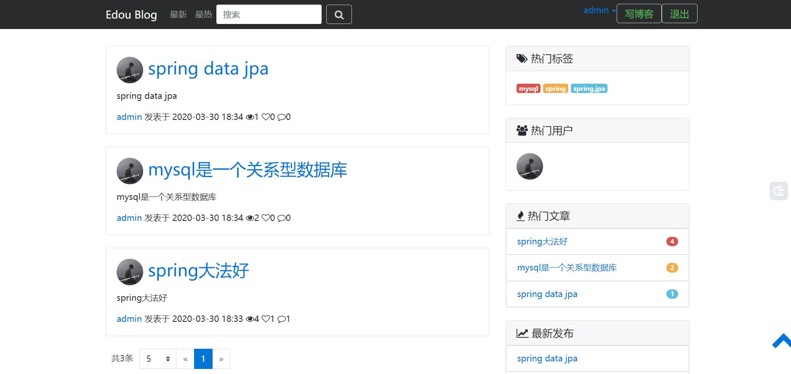
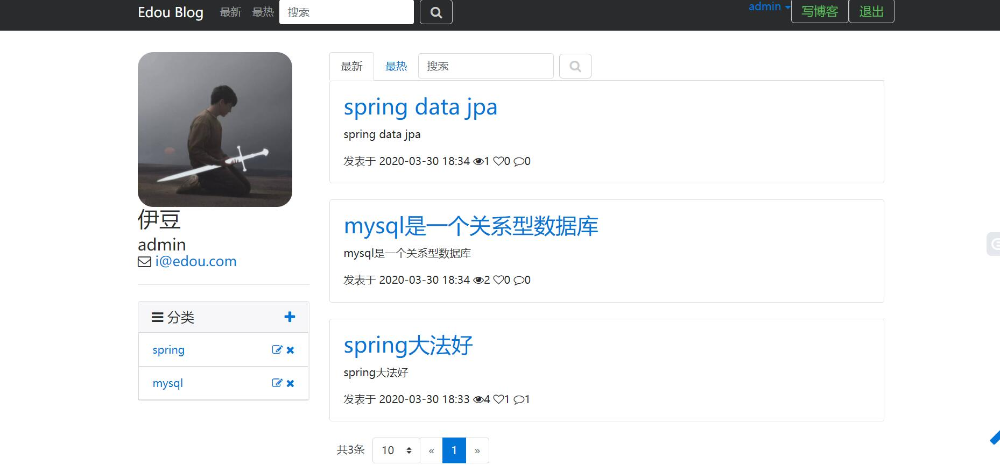
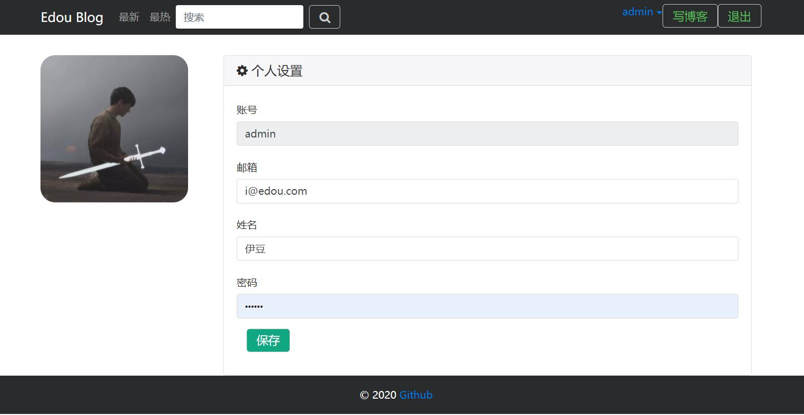
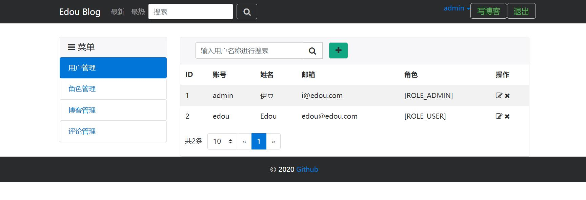
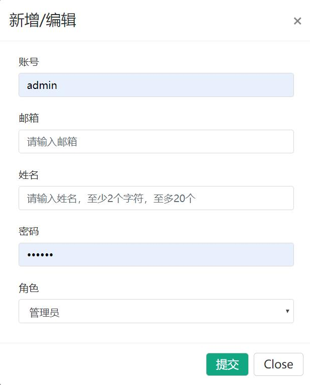
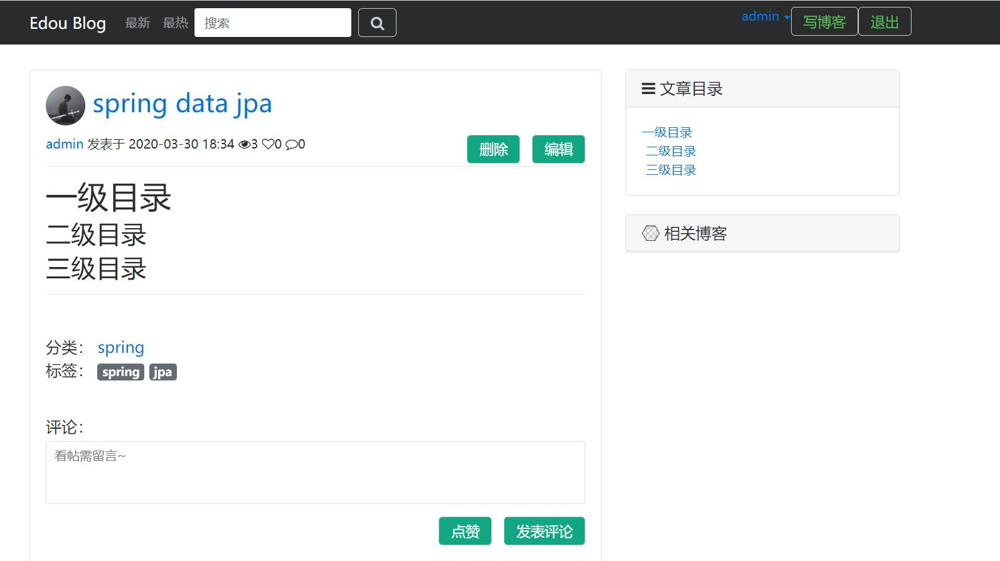
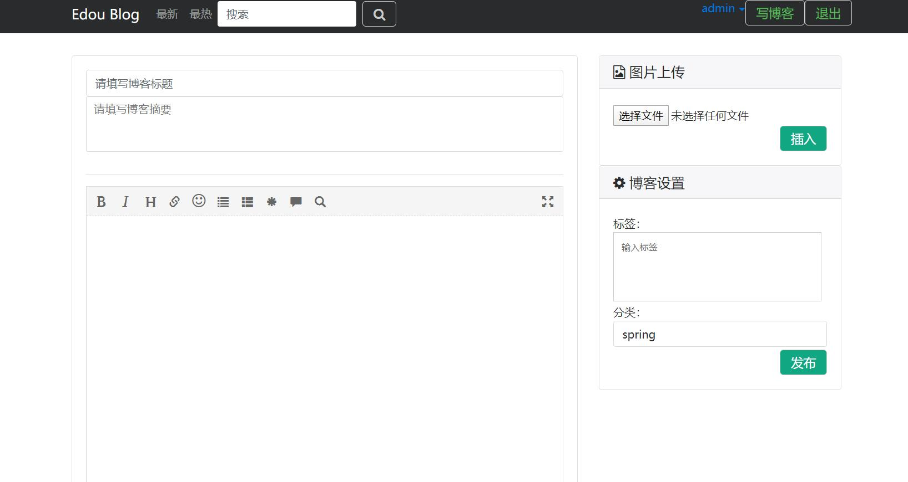

# blog
一个基于SpringBoot+Spring JPA+Bootstrap的多用户博客项目  
## 功能
1. 基于Spring Security的用户管理功能
2. 基于Spring Jpa的博客的增删改查功能
3. 博文的搜索 使用ElasticSearch
4. 博文编写 评论 点赞功能,可以使用MarkerDown编辑器
5. 可以基于标签,分类,最新,最热查询
6. 用户分为普通用户(博主)和管理员
7. 图片上传使用 自己基于MongoDB搭建的文件服务器
## 项目构建工具
gradle4.7
## SpringBoot版本
springBootVersion=2.0.1.RELEASE
## Mysql数据库
Mysql数据库5.5及以上  
sql脚本在/resources/sql下,第一次运行需要在配置文件中将这两行取消注释  
`spring.datasource.data=classpath:sql/import.sql`  
`spring.datasource.initialization-mode=always`  
之后将配置文件中的  
`spring.jpa.hibernate.ddl=create改为update`
## ElasticSearch配置
#### 版本5.6.8及以上
在application.yml中将ES配置为自己的
## 涉及到的文件上传服务器
[文件服务器地址](https://github.com/yidou120/mongodb-file-server)
## 博客展示图片
#### 首页   
#### 个人主页   
#### 个人信息编辑页面   
#### 管理员界面   
#### 添加用户页面   
#### 博客展示页面   
#### 博客编写页面   
## 运行部署
1. 首先将博客代码和文件服务器代码clone下来,相关配置改为自己的
2. 使用idea工具导入代码,分别启动两个应用即可
3. 打开浏览器: 访问 http://localhost:8080/blogs

## 存在的bug 
- 首页的博客列表是从ES查询的,如果使用ElasticRepository接口生成的代理方法去分页查询列表,不管如何都会返回所有列表.  
- 如果想让首页的列表显示一页5条,需要使用原生查询语法进行设置.